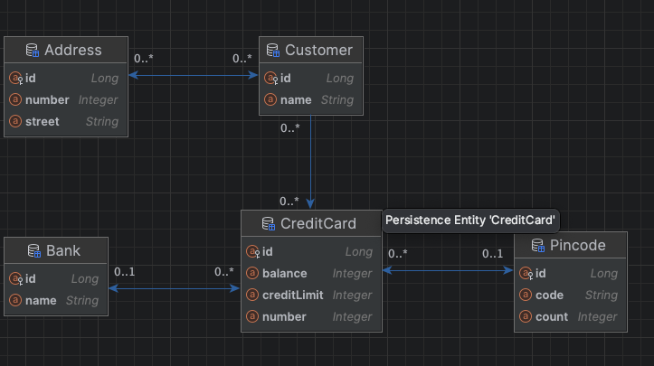

## Questions:
### Where is the database?
The database is an in-memory H2 database, configured through the Java Persistence API (JPA) using Hibernate as the ORM tool. The configuration details are specified in the persistence.xml file.

### How/When it runs?
The database is accessed when the EntityManager is invoked to perform CRUD operations. This occurs in the CreditCardsMain.java file, specifically within the createObjects(EntityManager em) method.

### SQL for creating the customer table
Hibernate automatically generates the SQL queries based on the Customer.java entity class and the settings in the persistence.xml file. The SQL query for creating the Customer table is:
```sql
CREATE TABLE Customer (
      id BIGINT GENERATED BY DEFAULT AS IDENTITY,
      name VARCHAR(255),
      PRIMARY KEY (id)
);
```

### Inspection of the database
The database tables and their relationships can be viewed in IntelliJ's JPA Persistence view. The schema appears as expected identical to how the task desierd the relationships to be, and a screenshot of the structure is included below.


## Technical Problems and Solutions

### Issue 1: Testing Object Fetch from Relationship
#### Problem:
The test for comparing a customer object against the list of customers fetched from address.getOwners() fails, even though the objects appear to be identical  the same object with the same hashcode and everything.
```
assertThat(address.getOwners(), is(Set.of(customer)));
```
The error i get is:
```
java.lang.AssertionError: 
Expected: is <[no.hvl.dat250.jpa.tutorial.creditcards.Customer@4f5c30b1]>
     but: was <[no.hvl.dat250.jpa.tutorial.creditcards.Customer@4f5c30b1]>
Expected :is <[no.hvl.dat250.jpa.tutorial.creditcards.Customer@4f5c30b1]>
Actual   :<[no.hvl.dat250.jpa.tutorial.creditcards.Customer@4f5c30b1]>
```
#### Possible Cause:
This could be related to Hibernate's handling of object equality, or it might be due to the use of Lombok for generating getters and setters.but adding @EqualsAndHashCode to the class did not help.

#### Solution:
Although modifying the test to ```assertThat(address.getOwners().iterator().next(), is(customer));``` solves the issue, the test was left unchanged as per the instructions.


### Issue 2: Testing Credit Card Objects
#### Problem:
A similar issue occurs when comparing credit card objects fetched from customer.getCreditCards()
The second issue is checking the creditcard against the creditcardlist from customer.getCreditCards()
```
assertThat(bank.getOwnedCards(), is(Set.of(firstCard, secondCard)));
```
This is an identical issue as the first one and the objects seems identical when inspecting them in debug and has the same hashcode.
Error below:
```
java.lang.AssertionError: 
Expected: is <[no.hvl.dat250.jpa.tutorial.creditcards.CreditCard@b8a144e, no.hvl.dat250.jpa.tutorial.creditcards.CreditCard@5fb8dc01]>
     but: was <[no.hvl.dat250.jpa.tutorial.creditcards.CreditCard@b8a144e, no.hvl.dat250.jpa.tutorial.creditcards.CreditCard@5fb8dc01]>
Expected :is <[no.hvl.dat250.jpa.tutorial.creditcards.CreditCard@b8a144e, no.hvl.dat250.jpa.tutorial.creditcards.CreditCard@5fb8dc01]>
Actual   :<[no.hvl.dat250.jpa.tutorial.creditcards.CreditCard@b8a144e, no.hvl.dat250.jpa.tutorial.creditcards.CreditCard@5fb8dc01]>
```